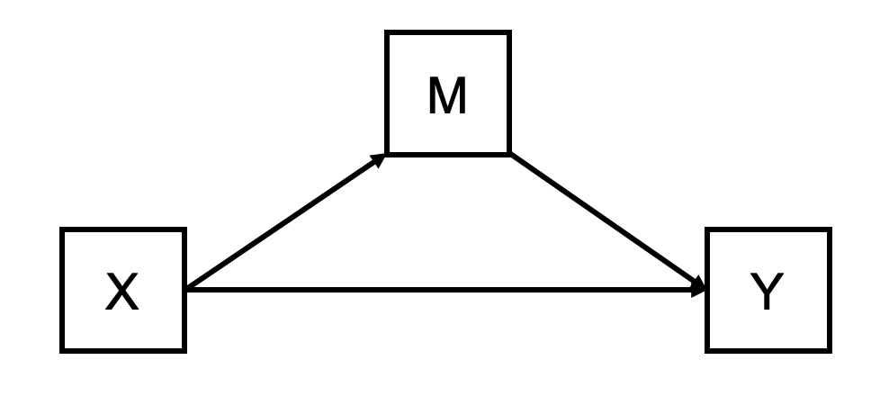

```{r setup}
options(knitr.table.format = "html")
knitr::opts_chunk$set(echo = TRUE, message = FALSE)
old.warn <- getOption("warn")
options(warn=-1)
```


```{r load package}
# install.packages("/Users/yinqiz/Documents/Research/exposome_data_challenge/LUCIDus_2.1.0.tar.gz",
#                  repos = NULL,
#                  type = "source",
#                  dependencies = TRUE)
library(ggplot2)
library(tidyverse)
library(Biobase)
library(lavaan)
library(HIMA)
library(bama)
library(LUCIDus)
library(reshape2)
library(networkD3)
library(mediation)
```


## 1. Introduction to Mediation Analysis
Previously, we studied how to analyze and interpret the association between risk factor and outcome of interest. However, the statistical association between risk factor and outcome sometimes is not enough to fully address the research question. Here is an example.

Organochlorines (OCs) are a group of chemical compounds that are widely used as pesticides and in industrial processes throughout most of the 20th century. The use of these chemicals has been discontinued in the United States and Europe, however, because of their persistence in the environment, the general population is still exposed to these substances at low doses, and relate adverse health outcomes are a major concern to public health. Several studies has revealed the statistical association between exposure to organochlorines is predictive to childhood obesity (Lee (2014) and Dirinck (2011)). However, the biological mechanisms of how organochlorines influence obesity are still unknown. If we can understand how organochlorines (independent variable) exert influence to obesity (dependent variable), health practitioners are able to conduct interventions to prevent epidemiology of obesity among children. 

Insulin is a well known peptide hormone which regulates the metabolism of carbohydrates and fats in human body and is directly related to obesity based on experimental evidence. It is a potential molecule that could explain the biological process (mechanism) between exposure to organochlorines and childhood obesity. To incorporate insulin in our study, our research question can be rephrased as

* Does exposure to organochlorines during pregnancy lead to deviant insulin level in children which ultimately leads to obesity?

Such question indicates a chain of relations where the independent variable affects the outcome through a third variable called mediator. Of course, the mediator is not restricted to biological factor. It can be psychological, social, environmental or even political variables. The standard statistical framework for answering the question above is called **mediation analysis**. In short, mediation analysis is a collection of regression models fitted on different combinations of risk factor, outcome and mediator. Baron and Kenny (1986) outlined the basic steps for the classical framework of mediation analysis. For better illustration of mediation analysis, we first define some notations and concept.

### Notation and Definition 
1. $X$: risk factor (independent variable)
2. $Y$: Outcome (dependent variable)
3. $M$: Mediator (a third variable which explains the mechanism of statistical association between $X$ and $Y$)
4. Total effect (TE): the statistical association of $X$ on $Y$. TE can be partitioned into direct effect and indirect effect.
5. Indirect effect (IDE): the statistical association of $X$ on $Y$ transmitted through $M$.
6. Direct effect (DE): the variance of $Y$ in TE that cannot be explained by IDE

For the rest of this tutorial, we will cover details on how to conduct mediation analysis and extend the simple mediation framework to multiple mediators.

## 2. Simple Mediation Analysis
To start with, we introduce the simple mediation analysis framework with only 1 mediator. Besides, we assume the risk factor, mediator and outcome are all continuous, although the idea of mediation can be naturally extended to outcomes belonging to an exponential family. The mediation analysis can be illustrated as the figure below.
```{r, out.width = "400px"}

```

This is a partial mediation model covered in the lecture. Following the methods suggested by Baron and Kenny (1986), the mediation analysis consists of three steps (regression models):

1. $X \rightarrow Y$ (characterize the **total** effect)
2. $X \rightarrow M$ (establish association between the risk factor $X$ and mediator $M$)
3. $X + M \rightarrow Y$ (charaterize the **direct** and **indirect** effect)

We will go through each step by using the research question mentioned above: whether insulin level mediates the association between exposure to organochlorine and obesity in children?

We still use the multi-assay data from the HELIX study to illustrate the analysis of mediation. Specifically, we explore the influence of exposure to hexachlorine (HCB, a subtype of organochlorines) during pregnancy on childhood obesity. The potential mediators we consider are proteomics data collected in blood sample of children.

```{r, message=FALSE}
# load multi assay experiment data
work.dir = "/cloud/project/Mediation"


dat = readRDS(file.path(work.dir, "HELIX_data.rds"))

# prepare dataset for simple mediation analysis
X = dat$hs_hcb_madj_Log2
M = dat$INSULIN
Y = dat$hs_zbmi_who
dat1 = data.frame(X = X, M = M, Y = Y)
```


### Step 1: Total Effect
The first step in simple mediation analysis is to estimate the **total** effect. The regression model for estimating the total effect is written as
$$
Y_i = \beta_0 + \beta_1X_i + \epsilon_{i, Y|X}
$$
where $i$ represents the index of observation, $\epsilon_{i, Y|X}$ represents the normally distributed error for observation $i$ conditioning on $X$. Here we use $\beta_1$ to represent the coefficient of risk factor $X$, which is the total effect (TE). In order to estimate the total effect, we fit the linear model and test the significance of the coefficient $\beta_1$. 
```{r}
model_1 = lm(Y ~ X, data = dat1)
summary(model_1)
```

**Interpretation of total effect:** Based on R output above, the total effect can be interpreted as: with one unit increase in exposure to HCB during pregnancy, the BMI of child will increase by 0.067. Therefore, exposure to HCB during pregnancy increases the risk of childhood obesity. The total effect, $\beta_1$ is statistically significant based on t-test (p = 0.013). 

Although this is what Baron and Kenny originally proposed for mediation analysis, however, this step is controversial. Shrout and Bolder (2002) argue that we can still detect mediation effect even the total effect is not significant. Now in practice, the first step of mediation analysis is used as a reference for researchers to get a sense of the overall association. We will always move forward with mediation analysis no matter the total effect $\beta_1$ is significant or not.

### Step 2: Mediator Model
The model we fit in the second step is called **mediator model**, which estimates the association between risk factor and the mediator. This estimation is a part of the **indirect** effect.
$$
M_i = \alpha_0 + \alpha_1X_i + \epsilon_{i, M|X}
$$
Still, $\epsilon_{i, M|X}$ represents the random error for $M$, conditioning on risk factor $X$. If $X$ is not significantly associated with $M$, then $M$ is just a third unrelate variable instead of a mediator which explains the mechanism of the association between $X$ and $Y$. 
```{r}
model_2 = lm(M ~ X, data = dat1)
summary(model_2)
```
**Interpretation of mediator model:** The mediator model establish the association between risk factor and the mediator. The key parameter is $\alpha_1$, the slope related to $X$. In our example, $\alpha_1 = 0.063$, which means with one unit increase in exposure to HCB during pregnancy, the insulin level in children will increase by 0.063 unit. 


### Step 3: Outcome Model
For step 3, we fit the  **outcome model**, including both risk factor $X$ and mediator $M$ in the regression model.
$$
Y_i = \gamma_0 + \gamma_1M_i + \beta_1^* X_i + \epsilon_{i, Y|M, X}
$$
What we we are interested in is to compare $\beta_1^*$ here to $\beta_1$ in the model fitted in step 1. If $X$ influences $Y$ through $M$, by introducing $M$ in the outcome model, the effect of $X$ on $Y$ will become weaker or even disappear. If the effect of $X$ gets weaker, we detect **partial mediation effect**. If it disappears, we detect **fully mediation** effect. Here disappearance refers to statistical non-significance.
```{r}
model_3 = lm(Y ~ X + M, data = dat1)
summary(model_3)
```

In our example, the coefficient of $X$ (exposure to HCB in mother during pregnancy) is not significant anymore while $M$ (insulin) is significant in the outcome model. Besides, the effect of $X$ decreases from 0.067 to 0.043, so a fully mediation effect is detected. Once we observe the evidence of mediation effect, we want to conduct inference on the mediation effect. This is conveniently done by an R package called `mediation`.

### Step 4: Mediation Analysis
```{r, message=FALSE}

result_simple_mediation = mediate(model_2, model_3, treat = "X", mediator = "M", boot = TRUE, sims = 200)
```
The main function in `mediation` is `mediate()`. Only two models are required to conduct mediation analysis in `mediate()`: the first model is the mediation model obtained from step 2 and the second is the outcome model from step 3.(Corresponding to our discussion in step 1: in practice, significance of total effect is not required to detect mediation effect). By setting `boot = T`, we use bootstrapping method to generate confidence interval for mediation effect. It might take some time to run the code because bootstrap is a replicated process of drawing samples with replacement from the original data and then conducting mediation analysis based on the these sample. By default, 1000 replications are used to build the confidence interval for our analysis. The number of replication can be changed by the parameter `sims`. To save time, here we use 200 replications.
```{r}
summary(result_simple_mediation)
```

**Interpretation of the mediation effect:** The total effect is the coefficient of $X$ in step 1: $X \rightarrow Y$. The direct effect (ADE) is $\beta^*_1$ in the outcome model obtained from step 3. The mediation effect (ACME) is the product of coefficient $\alpha_1$ in step 2 and the coefficient $\gamma_1$ in step 3. It also equals the total effect minus the direct effect, which is $\beta_1 - \beta_1^*$. `Prop.Mediated` represents 36% of variance in $Y$ is explained through the mediation effect. Overall, we detect a significant mediation effect of insulin (0.0242, p < 0.01) between exposure to Hexachlorobenzene in mother and childhood obesity.

## 3. Mediation Analysis with Multiple Mediator
In some cases, one single mediator is not enough to explain the biology behind the statistical association and it is of particular interest to incorporate multiple omics variables in mediation analysis. Back to our example, we previously discussed the mediation effect of insulin between exposure to Hexachlorobenzene in mother and obesity in children. Tumour necrosis factor (TNF)-alpha has been found over-expressed in adipose tissue from obese animals and human. Nieto-Vazquez (2008) conducted comprehensive molecular biological study to explore the mechanism how TNF-alpha regulates insulin resistance. As a result, it is natural to include TNF-alpha in our mediation pathway and jointly analyze the mediation effect of TNF-alpha and insulin on obesity.

The general pipeline of mediation analysis with multiple mediators is similar to the simple mediation framework. Here we utilize an R pakcage `lavaan` to achieve the goal of multiple mediation analysis, which is modeled as a Structural Equation Model (SEM). SEM is not one statistical "method", it is a framework of statistical analysis and mediation analysis is one of its application. For more details, please refer to Hasman (2015).

Let's define insulin as `M1` and TNF-alpha as `M2`. Firstly, we write out the multiple mediation models, including a single outcome model `Y ~ b1 * M1 + b2 * M2 + c * X` and a mediator model for each potential mediator (`M1 ~ a1 * X` and `M2 ~ a2 * X`). Next, we define the indirect (mediation) effect and the total effect. Lastly, we need to incorporate a covariance matrix for multiple mediators, this is expressed in terms of double tilde `~~`.
```{r}
dat2 = data.frame(X = X,
                  M1 = dat$INSULIN,
                  M2 = dat$TNFalfa,
                  Y = Y)
multipleMediation <- '
Y ~ b1 * M1 + b2 * M2 + c * X
M1 ~ a1 * X
M2 ~ a2 * X
indirect1 := a1 * b1
indirect2 := a2 * b2
total := c + (a1 * b1) + (a2 * b2)
# covariances
M1 ~~ M2
'
med_multiple_M <- sem(model = multipleMediation, data = dat2)
summary(med_multiple_M)
```

**Interpretation of output:**
The output is divided into several sections. The regression part presents the defined multiple mediation model. The variance, covariance sections are just estimates for variances and covariances of different variables included in our multiple mediation model. Note that there is a `.` dot symbol before the variable name in variance and covariance sections. This is because BMI (Y), Insulin (M1) and TNF-alpha (M2) are dependent variables. Therefore, the values of the variance/covariance in the output is an estimate of the residual variance: the left-over variance that is not explained by the risk predictor(s).

What we are interested in is the estimate in the last section, defined parameter related to the mediation effect. Here we obtained significant estimates for all three effect. The indirect effect of Insulin and TNF-alpha are opposite.

### With Constraints
When we include multiple mediators in our analysis, we might be interested in testing whether the indirect effects of different mediators are equal or not. Here in our example, we want to test the equivalence of indirect effects for `INSULIN` and `TNFalfa`. To conduct such hypothesis testing, we can build a mediation model with additional constraint: by setting the indirect effect of `M1`(`INSULIN`) equal to `M2` (`TNFalfa`). 
```{r}
# including a contrast in the model
constrainedMediation <- '
Y ~ b1 * M1 + b2 * M2 + c * X
M1 ~ a1 * X
M2 ~ a2 * X
indirect1 := a1 * b1
indirect2 := a2 * b2
total := c + (a1 * b1) + (a2 * b2)
# covariances
M1 ~~ M2
# constrain
indirect1 == indirect2
'
med_multiple_M2 <- sem(model = constrainedMediation, data = dat2)
summary(med_multiple_M2)
```
To conduct statistical inference, we can use `anova()` to do the Chi-squared test. This is a particularly useful test to compare several competing models. The model without constraint (`med_multiple_M`), fitted in the previous section, is nested in the model with constraint (`med_multiple_M2`), so we are able to use the Chi-squared test to do the analysis.

```{r}
anova(med_multiple_M, med_multiple_M2)
```

Because the Chi-squared test has a p-value less than 0.05, we reject the null hypothesis that there is no difference between the two mediation models. In other words, the indirect effect of insulin is statistically different from that of TNF-alpha and we will drop the constraints of indirect effect in our mediation model.

## 4. Reference
1. Lee, D.H., Steffes, M.W., Sjödin, A., Jones, R.S., Needham, L.L. and Jacobs Jr, D.R., 2011. Low dose organochlorine pesticides and polychlorinated biphenyls predict obesity, dyslipidemia, and insulin resistance among people free of diabetes. PloS one, 6(1), p.e15977.
2. Dirinck, E., Jorens, P.G., Covaci, A., Geens, T., Roosens, L., Neels, H., Mertens, I. and Van Gaal, L., 2011. Obesity and persistent organic pollutants: possible obesogenic effect of organochlorine pesticides and polychlorinated biphenyls. Obesity, 19(4), pp.709-714.
3. Hasman, A., 2015, January. An Introduction to Structural Equation Modeling. In ICIMTH (pp. 3-6).