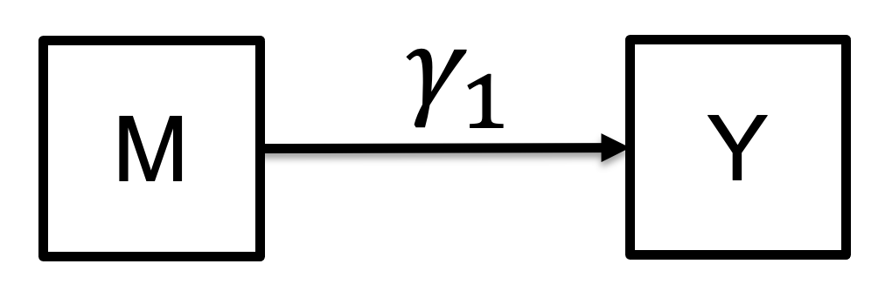
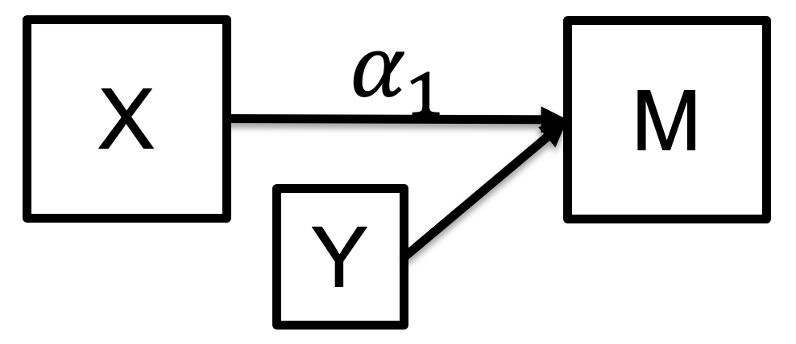
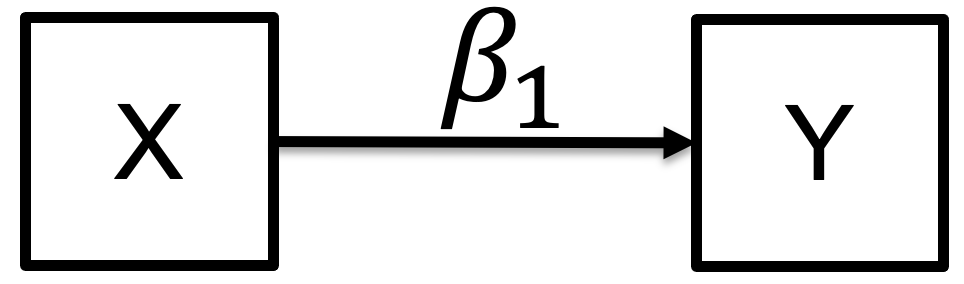

```{css, echo=FALSE}
pre {
  max-height: 200px;
  overflow-y: auto;
}
```

```{r setup}
options(knitr.table.format = "html")
knitr::opts_chunk$set(echo = TRUE, message = FALSE)
```


```{r load package}
# install.packages("/Users/yinqiz/Documents/Research/exposome_data_challenge/LUCIDus_2.1.0.tar.gz",
#                  repos = NULL,
#                  type = "source",
#                  dependencies = TRUE)
library(ggplot2)
library(tidyverse)
library(Biobase)
library(lavaan)
library(HIMA)
library(bama)
library(LUCIDus)
library(reshape2)
library(networkD3)
library(sm)
```


```{r, message=FALSE}
# read in data
work.dir = "/cloud/project/Labs/Mediation"
dat = readRDS(file.path(work.dir, "HELIX_data.rds"))
```


## 4. Advanced Mediation Analysis for High Dimensional Data
As biotechnology advances, the dimensionality of datasets considered as mediator, such our omcis data here, increases drastically. The extension of mediation analysis to multiple mediators is not enough to address the challenges arising from high dimensional data. Firstly, it is hard and tedious to write out the above multiple mediation model to a large number of mediators: imagine we have 1,000 variables in the omics dataset, we'll have to write a 1,000 line equation for that! Secondly, not all variables in the omics dataset are informative.). When simultaneously analyzing a relatively large number of mediators, potentially, researchers usually assume, which is often true, that only a small number of omics variables are truly active. Methods have been developed to address such challenge. In most cases, this high dimensional mediation analysis is treated as a variable selection problem by incorporating regularization techniques. For illustration purpose, we use a relatively small dataset with 45 omics variable to demonstrate some advanced mediation analysis for high dimensional data. 
```{r}
omics = as.data.frame(dat[, 27:ncol(dat)])
```


### 4.1 HIMA
We first introduce a method for testing high-dimensional mediation effects proposed by Zhang (2016), referred as HIMA which is the name of R package of their method. HIMA analysis consists of two steps. For HIMA, the idea is to fit separate mediator models for each mediator and a single outcome model consisting of all mediators.

$$
\begin{align*}
M_{ip} & = \alpha_{0p} + \alpha_{1p}X_{i} \quad \text{(Mediator Model)} \\
Y_i & = \gamma_0 + \beta_1^* X_i + \sum_{p = 1}^P \gamma_{1p}M_p \quad \text{(Outcome Model)}
\end{align*}
$$

The first step of HIMA is to reduce the candidate mediators to a moderate number, which is less that the sample size $n$. This is achieved by "Sure Independence Screening" (SIS). Then at step two, HIMA minimized the penalized sum of squares based on the outcome model, which is

$$
\min_{\mathbf{\gamma}} \sum_{i = 1}^n\left( Y_i - \gamma_0 - \beta^*_1X - \sum_{k \in K} \gamma_{1k} M_k \right) + \sum_{k \in K} p_{\lambda, \delta}(\gamma_{1k})
$$
where $K$ is the subset of mediators selected by the SIS from step 1, and $p_{\lambda, \delta}(\gamma_{1k}$ is the MCP penalty function for each coefficient related to mediators. Other penalty functions are available for `HIMA` package, including the widely used LASSO penalty.

**Intuition of HIMA:** HIMA consists of two steps. The first step is to decrease the number of candidate mediators less than the number of observations, in other words, to limit the number of parameters in the model less than the number of observations. Such screening step makes the design matrix of regression invertible and we are able to obtain stable model parameters for mediation model. The second step is to utilize a LASSO-type penalty to obtain a sparse solution for model parameters. LASSO-type penalty is able to shrink model parameters to 0 and we only keep mediators whose coefficient is not 0. The larger the penalty is, the more model parameters are shrunk to 0. As a result, we achieve variable selection for the high dimensional mediators.

```{r, message=FALSE}
med_multiple_hima = hima(X = dat$hs_hcb_cadj_Log2,
                         Y = dat$hs_zbmi_who,
                         M = omics,
                         Y.family = "gaussian",
                         penalty = "MCP")
# rename the column names for results from HIMA, in order to match the notations from slides
colnames(med_multiple_hima) = colnames(med_multiple_hima)[c(1, 3, 2, 4:7)]
colnames(med_multiple_hima)[4] = "alpha*gamma"
med_multiple_hima
```

**Interpretation of results:** 
The output of HIMA package is a data.frame containing mediation testing results of mediators selected by the penalty terms. From left to right, the estimates are:

1. alpha: coefficient estimates of exposure (X) –> mediators (M).
2. gamma: coefficient estimates of mediators (M) –> outcome (Y) (adjusted for exposure).
3. beta: coefficient estimates of exposure (X) –> outcome (Y) (total effect).
4. alpha*gamma: mediation effect.
5. % total effect: alpha*gamma / beta, percentage of the mediation effect out of the total effect. Note this is can be negative, depending on the sign of alpha, gamma and beta. This is not a "percentage" from 0 to 1; it is ratio of mediation effect over total effect, to give you a sense how strong the mediation effect is.
6. Bonferroni.p: statistical significance of the mediator adjusted by Bonferroni procedure.
7. BH.FDR: statistical significance of the mediator adjusted by Benjamini-Hochberg procedure.
In total, we identify 25 mediators as statistically significant.

### 4.2 BAMA
Song (2020) developed a Bayesian method using continuous shrinkage priors to extend the mediation framework to high-dimensional setting (referred as `BAMA` here, which is also the name of the package). The general idea of this method is to treat the high-dimensional mediation challenge as a variable selection problem. Consistent with the idea of omnigenic model, the author assumed that all mediators potentially contribute small effects in mediating the exposure-outcome relationship while only a small portion of mediators exhibiting large effects (these mediators are defined as core genes in the omnigenic model). 

In BAMA, we still define the mediator model and outcome model as below.

$$
\begin{align*}
M_{ip} & = \alpha_{0p} + \alpha_{1p}X_{i} \quad \text{(Mediator Model)} \\
Y_i & = \gamma_0 + \beta_1^* X_i + \sum_{p = 1}^P \gamma_{1p}M_p \quad \text{(Outcome Model)}
\end{align*}
$$

However, unlike HIMA, we make some Bayesian assumptions for the coefficients in the mediator model and outcome model. Specifically,

$$
\gamma_{1p} \sim \pi_{\gamma p} N(0, \tau^2_{\gamma_1}) + (1 - \pi_{\gamma p})N(0, \tau_{\gamma_0}^2) \\
\alpha_{1p} \sim \pi_{\alpha p} N(0, \tau^2_{\alpha_1}) + (1 - \pi_{\alpha p})N(0, \tau_{\alpha_0}^2)
$$
where $\tau_{\gamma_1}^2 > \tau_{\gamma_2}^2$ and $\tau_{\alpha_1}^2 > \tau_{\alpha_2}^2$. The normal component with larger variance refers to the group of active mediator. The posterior inclusion probability (PIP) is defined as the probability of both $\gamma_{1p}$ and $\alpha_{1p}$ for mediator $p$ being chosen from the group of active mediator.


**Intuition of BAMA:** 
The active mediators are assumed to belong to a normal distribution with larger variance, which is $N(0, \sigma^2_{M_1})$ and $N(0, \sigma_{E_1}^2)$. Therefore, the active mediators will have a larger effect based on the prior. Let's use the following bell shape curve for better illustration.

```{r}
set.seed(123)
norm1 = rnorm(2000, sd = 0.5)
norm2 = rnorm(2000, sd = 2)
value = c(norm1, norm2)
label = as.factor(c(rep("inactive", 2000), rep("active", 2000)))
sm.density.compare(value, label, xlab = "coefficient")
title(main="Compare prior for active and inactive meiators")
```

The active mediators are drawn from the "flat" bell shape curve colored as red. Comparing to the curve for inactive mediator, the active mediator has a larger probability (measured in terms of the area under the curve) to get an large coefficient.


```{r, message=FALSE}
# We add intercept term since we don't include any covariates here
C1 = matrix(1, nrow(omics), 1)
C2 = matrix(1, nrow(omics), 1)
med_multiple_bama = bama(Y = as.vector(dat$hs_zbmi_who),
                         A = as.vector(dat$hs_hcb_cadj_Log2),
                         M = as.matrix(omics),
                         C1 = C1, C2 = C2, method = "BSLMM", seed = 1234,
                         burnin = 1000, ndraws = 1100, weights = NULL, inits = NULL, 
                         control = list(k = 2, lm0 = 1e-04, lm1 = 1, l = 1))

result_bama = summary(med_multiple_bama)
colnames(result_bama)[1] = "alpha*gamma"
# show active mediators whose PIP > 0
result_bama[result_bama$pip > 0, ]
```


## 5. Incoporating Multiple Exposures in Mediation Analysis
We have discussed several approaches based on the simple mediation analysis. All of them focus on incorporating multiple intermediate variables (mediators) in the mediation analysis. However, it is now more and more popular to measure a collection of exposure variables and jointly estimate their effect on the health outcome. For example, organochlorines consist different types of chemical compounds. Exposure to HCB is just one of them. In HELIX study, the investigators measure the comprehensive exposure profiles to organochlorines. Therefore, it is desirable to incorporate all exposures in our analysis. One way to incorporate multiple exposures in the mediation analysis is the "meet in the middle" approach that we discussed in the lecture. (Cadiou, 2021)

### Step 1
```{r, out.width = "400px", echo=FALSE}

```


Test the association between the intermediate ($M$) and outcome ($\gamma_1$). Correct for multiple comparisons (FDR) over $P$ intermediates.
```{r}
Y = dat[, "hs_zbmi_who"]
# step 1: test each omics variable and the outcome
p_step1 = rep(0, ncol(omics)) # vector to store unadjusted p-values
coef_step1 = rep(0, ncol(omics)) # vector to store coefficient for omics variable
for (i in 1:ncol(omics)) {
  temp_dat = data.frame(m = omics[, i], y = Y)
  temp_fit = lm(hs_zbmi_who ~ m, temp_dat)
  p_step1[i] = summary(temp_fit)$coefficients[2, 4]
  coef_step1[i] = summary(temp_fit)$coefficients[2, 1]
}
p_step1_adj = p.adjust(p_step1, method = "fdr")
sum(p_step1_adj < 0.1)
# store the selected omics variable
omics_select_step1 = omics[, p_step1_adj < 0.1]
```

There are 120 omics variable whose FDR < 0.1. They will be included in the further analysis.


### Step 2
```{r, out.width = "400px", echo=FALSE}

```

For those determined "noteworthy" from step 1, test the association ($\alpha_1$) of the exposures ($X$) to intermediates ($M$), adjusted for the outcome. Correct for multiple comparisons (FDR) with total number of exposures $\times$ intermediates.

```{r}
# step 2: test association beteen each omics variable selected from step 1 and the the exposure, adjusted for outcome
exposure = as.data.frame(dat[, 2:19])
p_step2 = matrix(rep(0, ncol(exposure) * ncol(omics_select_step1)), nrow = ncol(exposure)) # matrix to store unadjusted p-values
coef_step2 = matrix(rep(0, ncol(exposure) * ncol(omics_select_step1)), nrow = ncol(exposure)) # matrix to store coefficient
for (i in 1:ncol(exposure)) {
  for (j in 1:ncol(omics_select_step1)) {
    temp_dat = data.frame(x = exposure[, i], m = omics_select_step1[, j], y = Y)
    temp_fit = lm(m ~ x + hs_zbmi_who, temp_dat)
    p_step2[i, j] = summary(temp_fit)$coefficients[2, 4]
    coef_step2[i, j] = summary(temp_fit)$coefficients[2, 1]
  }
}
p_step2_adj = matrix(p.adjust(as.vector(p_step2), method = "fdr"), nrow = ncol(exposure))

# check how many exposure is at least significantly associated with 1 mediator
sum(rowSums(p_step2_adj < 0.1) > 0)
```

All exposures are significantly associated with at least one mediator selected from step 1. All of them will be included in the further analysis.


### Step 3
```{r, out.width = "400px", echo=FALSE}

```

For those exposures that are significantly associated with at least one mediator, test the significance of their associations to the outcome. Exposures found significantly associated with the outcome in this step are the output of this selection method.
```{r}
# Step 3: ExWAS
ExWAS_coef = rep(0, 18)
ExWAS_p = rep(0, 18) # 18 exposures in total
for (i in 1:18) {
  temp_dat = data.frame(x = exposure[, i], y = Y)
  temp_fit = lm(hs_zbmi_who ~ x, data = temp_dat)
  ExWAS_coef[i] = summary(temp_fit)$coefficients[2, 1]
  ExWAS_p[i] = summary(temp_fit)$coefficients[2, 4]
}
ExWAS_p_adj = p.adjust(ExWAS_p, method = "fdr")

# number of selected exposures
sum(ExWAS_p_adj < 0.1)
```

16 exposures are found significant at this step. We will present their significant associations from step 2 and step 3. 

First, let's check the associations between selected exposures and the selected omics variable. Since we have 16 $\times$ 120 associations, we will present the results in a heatmap. The significant associations are marked by star.

```{r}
# association between each exposure selected and the omics layer (step 2)
# reshape the data
colnames(coef_step2) = colnames(omics_select_step1)
# include exposures selected from step 3
coef_select = coef_step2[ExWAS_p_adj < 0.1, ]
melt_coef_select = as_tibble(coef_select) %>%
  mutate(exposure = colnames(exposure)[ExWAS_p_adj < 0.1]) %>%
  pivot_longer(!exposure, names_to = "omics", values_to = "coef")
colnames(p_step2_adj) = colnames(omics_select_step1)
p_select = p_step2_adj[ExWAS_p_adj < 0.1, ]
melt_p_select = as_tibble(p_select) %>%
  mutate(exposure = colnames(exposure)[ExWAS_p_adj < 0.1]) %>%
  pivot_longer(!exposure, names_to = "omics", values_to = "p_value")
plot_dat1 = left_join(melt_coef_select, melt_p_select, by = c("exposure", "omics")) %>% 
  mutate(sig = ifelse(p_value < 0.1, "*", ""))
ggplot(data = plot_dat1, aes(x = omics, y = exposure, fill = coef)) + 
  geom_tile(colour="white") + 
  scale_fill_gradient2(name = "Coefficient") +
  theme(
        text = element_text(size = 6),
        axis.text.x=element_blank(),
        panel.background = element_blank()) +
  geom_text(aes(label = sig), size=1, na.rm=TRUE) + # add significance label
  ggtitle("Pairwise association between selected exposure and selected omics variables")
```

Next, we examine the significant associations between selected exposures and outcome.
```{r}
result_final = data.frame(Exposure = colnames(exposure)[ExWAS_p_adj < 0.1],
                          Coefficient = ExWAS_coef[ExWAS_p_adj < 0.1],
                          P_adjust = ExWAS_p_adj[ExWAS_p_adj < 0.1])
result_final
```


## Reference
1. Baron, R.M. and Kenny, D.A., 1986. The moderator–mediator variable distinction in social psychological research: Conceptual, strategic, and statistical considerations. Journal of personality and social psychology, 51(6), p.1173.
2. Shrout, P.E. and Bolger, N., 2002. Mediation in experimental and nonexperimental studies: new procedures and recommendations. Psychological methods, 7(4), p.422.
3. Cadiou, S., Basagaña, X., Gonzalez, J.R., Lepeule, J., Vrijheid, M., Siroux, V. and Slama, R., 2021. Performance of approaches relying on multidimensional intermediary data to decipher causal relationships between the exposome and health: A simulation study under various causal structures. Environment International, 153, p.106509.
4. Nieto-Vazquez, I., Fernández-Veledo, S., Krämer, D.K., Vila-Bedmar, R., Garcia-Guerra, L. and Lorenzo, M., 2008. Insulin resistance associated to obesity: the link TNF-alpha. Archives of physiology and biochemistry, 114(3), pp.183-194.

