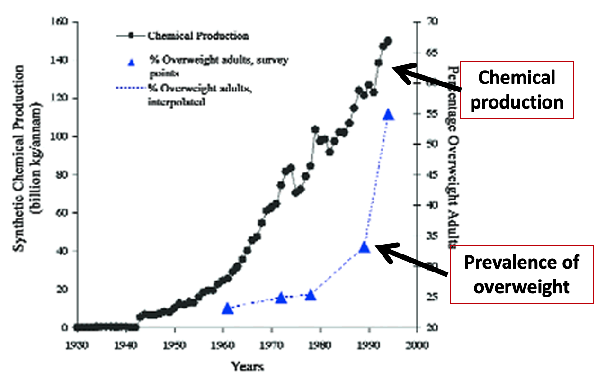
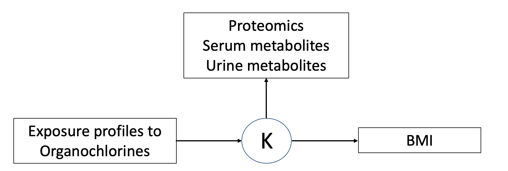
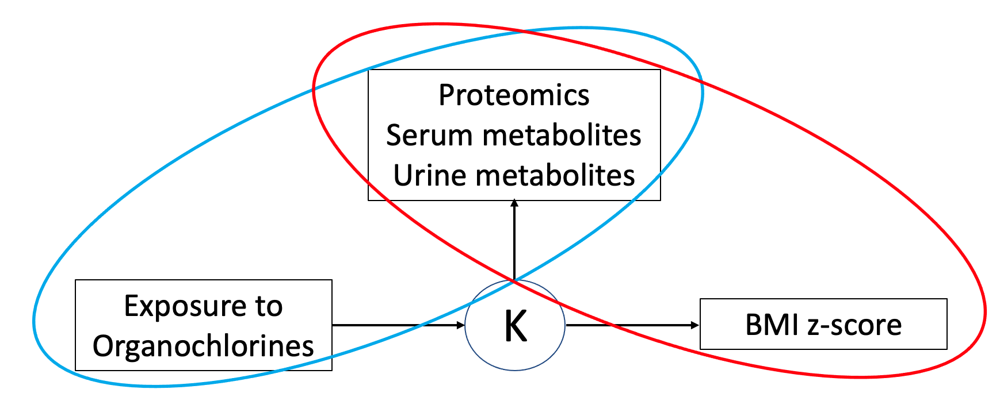
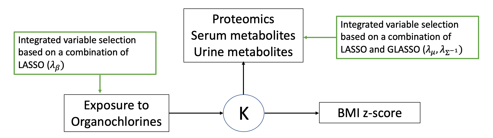
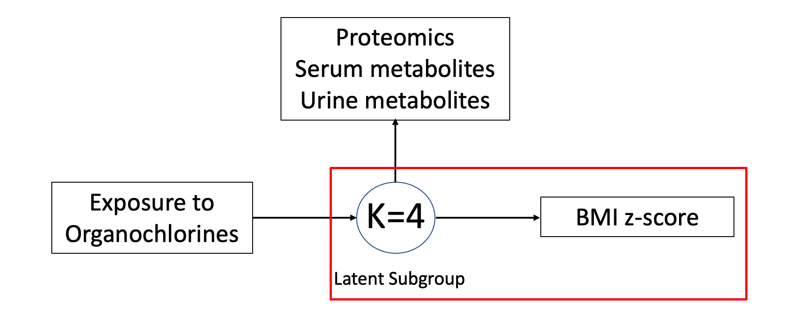
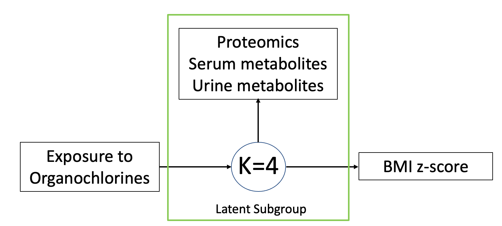
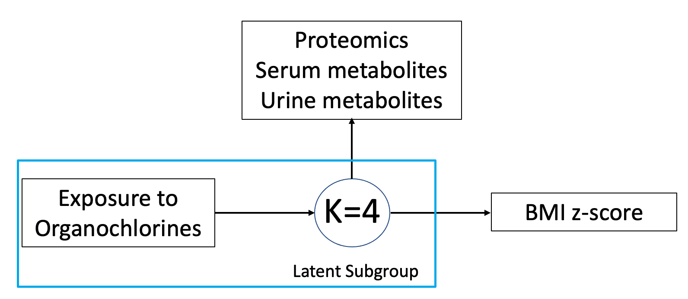
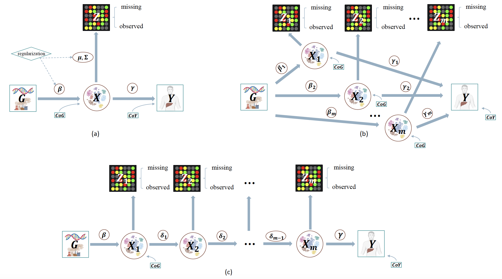

```{css, echo=FALSE}
pre {
  max-height: 200px;
  overflow-y: auto;
}
```

```{r setup}
options(knitr.table.format = "html")
knitr::opts_chunk$set(echo = TRUE, message = FALSE)
```


```{r load package}
library(ggplot2)
library(tidyverse)
library(Biobase)
library(lavaan)
library(HIMA)
library(bama)
library(LUCIDus)
library(reshape2)
library(networkD3)
library(sm)
library(plotly)
#install.packages("janitor")
library(janitor)
```


```{r, message=FALSE}
# read in data
work.dir = "/cloud/project/Labs/Mediation"
dat = readRDS(file.path(work.dir, "HELIX_data.rds"))
#loading plotting function for LUCID (highly customizable functions for complex LUCID model that are not built in the LUCIDus package)
source(file.path(work.dir, "/plotting_func/plot_lucid_in_parallel.R"))
source(file.path(work.dir, "plotting_func/plot_lucid_in_serial.R"))
source(file.path(work.dir, "plotting_func/plot_omics_profiles_general.R"))
```


## 6 Latent Unknown Clustering Integrating omics Data (LUCID)
LUCID allows user to incorporate and analyze multiple omics layers at the same time. LUCID is an integrative analysis, which jointly estimates latent clusters based on multiple omics layers and associates latent clusters with outcome of interest. In the lecture, we have covered the theoretical part of the LUCID model. We will go through the details of its application in a real world study.

### 6.1 Background


In 2002, physician Paula Baillie-Hamilton conducted a study revealing that the obesity epidemic correlated with the increased production of synthetic chemicals. Among them, organochlorines (OCs) constitute a major class of synthetic chemicals with suspected obesogenic properties. The effects of OC are biomagnified through the food chain, and especially affect the health outcome of pregnant woman and children.

OCs include synthetic chemicals that were widely used as pesticides and in industrial processes throughout most of the 20th century. The use of these chemicals are discontinued in the United States and Europe, however, because of their persistence in the environment, the general population is still exposed to these substances at low doses, and adverse health outcomes related to background population levels of exposure are a major concern. OCs are ubiquitous and persist in the environment, accumulate in high concentrations in fatty tissues, and are biomagnified through the food chain. 

Pregnancy and childhood constitute periods of high vulnerability to chemical toxic effects, as it is when rapid tissue development occurs while there is incomplete development or function of protective mechanisms, such as xenobiotic metabolism and immune function

**Research Question:**
1. Explore the association between exposure to OCs and BMI (measured as a standardized BMI z-score)
2. Estimate the latent clusters in children characterized by exposome (exposure to OCs) and multiple omics layers (proteomics, serum metabolites and urinary metabolites); construct exposure and omics profiles for children with high risk of obesity


We use the LUCID model to analyze this research question, which can be expressed as the DAG below.



### 6.1 Prepare data for LUCID and conduct preliminary screening
First, let's prepare data for LUCID. The LUCID model takes `matrix`, or `matrix`-like data (such as `data.frame`) as input. If input is vector, it will be transformed into a `matrix` automatically. Besides, since we incorporate multiple layers of omics data which are measured at different scales, it's recommended to standardize multiple omics data to make sure they are at the same scale.
```{r, message=FALSE}
#===================================#
## 1. prepare data for LUCID model ##
#===================================#
exposure = dat[, 2:19]
omics = scale(as.matrix(dat[, 27:ncol(dat)])) # scale the omics
outcome = dat[, "hs_zbmi_who"]
cova_names = c("h_mbmi_None", "e3_sex_None", "h_age_None", "h_cohort", "h_edumc_None")
covariate = model.matrix(~., dat[, cova_names])[, -1]
```


Next, we conduct a preliminary screening to decrease the number of omics variables to a moderate number. Here we use the idea of pairwise association between exposure and omics layer, and between omics layer and the outcome. This is similar to the "meet in the middle" approach we conducted in the previous lab. 

```{r}
#===========================================#
## 2. preliminary screening for omics data ##
#===========================================#
# 1.1 E and Y
expo_names = colnames(exposure)
res_E_Y = NULL
for (i in 1:length(expo_names)) {
  temp_fit = lm(as.formula(paste("hs_zbmi_who ~", expo_names[i], " + ", paste(cova_names, collapse = " + "))), 
                data = dat)
  temp_sum = summary(temp_fit)
  res_E_Y = rbind(res_E_Y, temp_sum$coefficients[2, ])
}
rownames(res_E_Y) = expo_names


# 1.2 M and Y
M_names = colnames(omics)
res_M_Y = NULL
for (i in 1:length(M_names)) {
  temp_fit = lm(as.formula(paste("hs_zbmi_who ~", M_names[i], " + ", paste(cova_names, collapse = " + "))), 
                data = dat)
  temp_sum = summary(temp_fit)
  res_M_Y = rbind(res_M_Y, temp_sum$coefficients[2, ])
}
rownames(res_M_Y) = M_names
p_adj1 = p.adjust(res_M_Y[, 4], method = "fdr")
res_M_Y = cbind(res_M_Y, p_adj1)
colnames(res_M_Y)[5] = "p_fdr"


# 1.3 E and M
res_M_E = NULL
for (i in 1:length(M_names)) {
  for (j in 1:length(expo_names)) {
    temp_fit = lm(as.formula(paste(M_names[i], "~", expo_names[j], "+", paste(cova_names, collapse = " +"))),
                  data = dat)
    temp_sum = data.frame(est = summary(temp_fit)$coefficients[2, 1],
                          p = summary(temp_fit)$coefficients[2, 4])
    temp_sum$M = M_names[i]
    temp_sum$E = expo_names[j]
    res_M_E = rbind(res_M_E, temp_sum)
  }
}
res_M_E$p.adj = p.adjust(res_M_E$p, method = "fdr")


# 1. M should be significantly associated with at least 1 exposure
# 2. M should be significantly associated with the outcome
# cutoff: fdr = 0.1
name1 = unique(rownames(res_M_Y)[res_M_Y[, 5] < 0.1])
name2 = unique(res_M_E$M[res_M_E$p.adj < 0.1])
common_name = intersect(name1, name2) 
length(common_name) # 45 metabolites passed preliminary screening
omics_selected = omics[, common_name]
```
The preliminary screening selected 45 metabolites out of 257 omcis variables.

### 6.2 Conduct variable selection

After preliminary screening, 45 proteins or metabolites are selected. The number is still moderately large and we hope to further decrease the number of omics variables to facilitate interpretation of the LUCID model. LUCID comes with an integrated variable selection based on $L_1$ penalties. Next, we show how to tune penalty terms for LUCID and conduct integrated variable selection.

```{r, results='hide'}
#===================================#
## 3. conduct variable selection   ##
#===================================#


# step 1: tune the model parameters
#=============================================================
# this chunk of codes is time-consuming, you can try it later;
# we use the results of this tuning process directly
#=============================================================
# set.seed(123)
# tune_lucid <- lucid(G = exposure,
#                     Z = omics_selected,
#                     Y = outcome,
#                     CoY = covariate,
#                     Rho_G = c(0.005, 0.01),
#                     Rho_Z_Mu = c(30, 40, 50),
#                     Rho_Z_Cov = c(0.1, 0.2, 0.3),
#                     K = 4,
#                     lucid_model = "early",
#                     init_omic.data.model = NULL)

# # check the optimal tuning parameters
# tune_lucid$tune_list

# step 2: integrated variable selections
#==========================================================================
#  optimal model: K = 4, Rho_Z_Cov = 0.1, Rho_Z_Mu = 50, Rho_G = 0.01
#==========================================================================
set.seed(123)
fit_try1 = estimate_lucid(G = exposure, 
                     Z = omics_selected, 
                     Y = outcome, 
                     CoY = covariate,
                     useY = FALSE, 
                     K = 4,
                     family = "normal",
                     Rho_Z_Cov = 0.1, 
                     Rho_Z_Mu = 50,
                     Rho_G = 0.01,
                     lucid_model = "early",
                     init_omic.data.model = NULL)
# refit the model with the selected features
set.seed(123)
fit_try2 = estimate_lucid(G = exposure[, fit_try1$select$selectG],
                     Z = omics_selected[, fit_try1$select$selectZ],
                     Y = outcome, 
                     CoY = covariate,
                     useY = FALSE, 
                     K = 4, 
                     family = "normal", 
                     lucid_model = "early",
                     init_omic.data.model = NULL)
```

`summary_lucid` summarizes LUCID model and print out a table explaining associations among each components of LUCID. This summary table is very useful when a few number of environmental/genetic exposures and omic variables are included. Otherwise, it's better to interpret LUCID model through a Sankey diagram, as we'll show later.
```{r}
print.sumlucid(summary_lucid(fit_try2))
```

### 6.3 Prediction of LUCID model
After fitting the LUCID model with selected features, we can predict the cluster assignment for each observaton by calling the `predict_lucid` function.
```{r}
# prediction of LUCID model
pred_fit_try2 = predict_lucid(model = fit_try2, 
                              G = exposure[, fit_try1$select$selectG],
                              Z = omics_selected[, fit_try1$select$selectZ],
                              CoY = covariate,
                              lucid_model = "early")
# prediction on latent cluster
table(pred_fit_try2$pred.x)
```


### 6.4 Visualize LUCID model
LUCID uses a Sankey diagram to visualize the complex associations among different components. In the Sankey diagram of LUCID, each node represents a variable in our dataset (for example, exposure to different organochlorines, various omics feature) and each link represents a statistical association. The color of the link indicates the direction of association: by default, light blue represents positive association while dark blue represents negative association. The width of the link indicates the magnitude of association: the wider a link is, the stronger the statisitcal association is.
```{r}
#===================================#
## 3. visualize the LUCID model    ##
#===================================#
# 1. use internal plot function
plot_lucid(fit_try2)
# 2. personalize color
# user can personalize colors of node and link
plot_lucid(fit_try2,
           G_color = "red",
           X_color = "blue",
           Z_color = "green",
           Y_color = "black",
           pos_link_color = "orange",
           neg_link_color = "gray")
```


### 6.5 Create omics and exposure profiles based on LUCID model {.tabset}
#### Distribtuion of BMI across 4 clusters

```{r}
#========================================================================#
## 4. Distribution of zBMI score for each cluster predicted by LUCID    ##
#========================================================================#
Y_fit_try2 = as.data.frame(cbind(cluster = as.factor(pred_fit_try2$pred.x), dat[, "hs_zbmi_who"]))
Y_fit_try2 = melt(Y_fit_try2, id.vars = "cluster")
ggplot(Y_fit_try2, aes(x = as.factor(cluster), 
                       y = value, 
                       goup = as.factor(cluster))) +
  geom_boxplot() +
  xlab("cluster") +
  ylab("z-bmi")
```

To interpret the clustering results of LUCID, we can create box plot of BMI z-score for each latent luster. From the boxplot, we observe an increasing trend of BMI from cluster 1 to cluster 4. In other words, children belonging to cluster 4 are at high risk of obesity.

#### Omics profiles for each identified cluster

```{r}
#=============================================================#
## 5. Omics profiles for  each cluster predicted by LUCID    ##
#=============================================================#
M_mean = as.data.frame(fit_try2$res_Mu)
M_mean$cluster = as.factor(1:4)
M_mean_melt = melt(M_mean, id.vars = "cluster")
# add color label for omics layer
M_mean_melt$color_lable = rep("1", nrow(M_mean_melt))
M_mean_melt[grep("serum", M_mean_melt$variable), "color_lable"] = "2"
M_mean_melt[grep("urine", M_mean_melt$variable), "color_lable"] = "3"
ggplot(M_mean_melt, aes(fill = color_lable, y = value, x = variable)) +
  geom_bar(position="dodge", stat="identity") +
  ggtitle("Omics profiles for 4 latent clusters") +
  facet_wrap(~cluster) +
  facet_grid(rows = vars(cluster)) +
  theme(legend.position="none") +
  xlab("") +
  theme(text = element_text(size=10),
        axis.text.x = element_text(angle = 45, vjust = 1,
                                   hjust = 1))
```

This figure, the y-axis represents the estimated mean expression level for each metabolite. We could observe distinguished pattern of omic profiles for each subgroup. We want to specifically highlight 3 proteins: insulin, IL1-beta and IL-6. Latent cluster 4, the high risk subgroup, is particularly characterized with elevated levels of IL-1beta and IL-6, two key markers of systemic inflammation in the human body and higher levels of insulin, which is known to closely associate with obesity and underlying metabolic dysfunction.


#### Exposure profiels for each identified cluster

```{r}
#================================================================#
## 6. Exposure profiles for  each cluster predicted by LUCID    ##
#================================================================#
E_mean = as.data.frame(fit_try2$res_Beta[, -1])
E_mean$cluster = as.factor(1:4)
E_mean_melt = melt(E_mean, id.vars = "cluster")
ggplot(E_mean_melt, aes(fill = variable, y = value, x = variable)) +
  geom_bar(position="dodge", stat="identity") +
  ggtitle("Exposure profiles for 4 latent clusters") +
  facet_wrap(~cluster) +
  facet_grid(rows = vars(cluster)) +
  geom_hline(data = data.frame(yint=0, cluster ="1"), aes(yintercept = yint), linetype = "dashed", color = "red") +
  theme(legend.position="none") +
  xlab("") +
  theme(text = element_text(size=10),
        axis.text.x = element_text(angle = 45, vjust = 1,
                                   hjust = 1))
```

This figure shows the exposures profile for each cluster. The y axis represent the log odds ratio for each exposure. As you can see, exposure profile characterization is mainly driven by log odds ratio of HCB in the maternal and child plasma. Moving from cluster 2 to 4, log odds ratio of childhood HCB are decreasing. This confirmed previous HELIX publication results (Vrijheid EHP 2020) that childhood HCB exposure cross-sectionally associates with reduced childhood BMI-z score. Moving from cluster 2 to 4, log odds ratio of maternal HCB are increasing. This implies maternal HCB exposure increases BMI (obesogenic effect).

## Exploration
In the analysis above, we conducted early integration for multi-omics data by concatenating three layers (serum metabolites, urine metabolites and proteins). What will results differ if we conduct late integration (analyzing each omic layer separately then combine the results?) You can pick the selected exposure or any exposure of interest.

1. **Exposure**: column 2 to 19, `dat[, 2:19]`
2. **Covariate**: column 20 to 24, `dat[, 20:24]`
3. **Outcome**: column 26, `dat[, 26]`
4. **Serum metabolites**: column 27 to 203, `dat[, 27:203]`
5. **Urine metabolites**: column 204 to 247, `dat[, 204:247]`
6. **Proteins**: column 248 to 283, `dat[, 248:283]`

## Intermediate and Late Integration


Three DAGs represent how three different types of the LUCID model integrate ge-
netic/environmental exposures (G), other multi-omics data (Z), and the phenotype trait (Y). (a)
LUCID early integration; (b) LUCID in parallel; (c) LUCID in serial. 

In the previous sections, we focus on using the early integration strategy by concatenating each omic layer one by one and inputting a single data matrix into the LUCID model for estimation. However, researchers may be interested in modeling the correlation structure of each omic layer independently to investigate how multi-omics data may act in parallel with an outcome. Recent advancement of the LUCIDus package allows us to do it.

```{r}
#================================================================#
## 7. Group different omic layers for selected omics features   ##
#================================================================#
omics_selected = as.data.frame(omics_selected)
# Extract serum features
S_metab <- omics_selected[, grep("^serum", names(omics_selected), value = TRUE)]

# Extract urine features
U_metab <- omics_selected[, grep("^urine", names(omics_selected), value = TRUE)]

# Extract Protein features
Proteins <- omics_selected[,names(omics_selected)[!grepl("^serum|^urine", names(omics_selected))]]

#Put them in a list
omics_selected_list <- list(as.matrix(S_metab), as.matrix(U_metab), as.matrix(Proteins))
```


```{r}
#================================================================#
## 8. Intermediate Integration: LUCID in Parallel    ##
#================================================================#

#Here, since we have a small number of features in each layer, we don't use regularity
fit_try3 = estimate_lucid(G = exposure, 
                     Z = omics_selected_list, 
                     Y = outcome, 
                     CoY = covariate,
                     useY = FALSE,  
                     K = c(2,2,2), #2 latent cluster for each layer
                     family = "normal",
                     lucid_model = "parallel")
#get the summary table of the model
#print.sumlucid(summary_lucid(fit_try3))

#add a prefic for proteins features as they don't have a common pattern
fit_try3$var.names$Znames[[3]] <- paste("protein", fit_try3$var.names$Znames[[3]], sep = "_")

#visualize LUCID in parallel
#Sankey Diagram
plot_lucid_in_parallel_plotly(fit_try3, 
                              sankey_colors = sankey_colors_parallel,
                              text_size = 10,
                              n_z_ftrs_to_plot = c(7,7,7))
#omics profile
plot_omics_profiles(fit_try3, "intermediate",pattern_list = list("serum","urine","protein"), omics_list = list("serum","urine","protein"))
```

In a more late integration framework, LUCID can also be extended to incorporate multiple latent variables in a serial fashion if researchers believe that given an exposure, multi-omics data act serially through a multistep process towards the outcome. This framework can accommodate the following situations: (1) longitudinal measurements on the same multi-omics data type and (2) biological relationship of multi-omics data. The estimation of latent clusters for each omic layer can be formulated as an unsupervised LUCID early integration or LUCID in parallel sub-model.

```{r}
#================================================================#
## 9. Late Integration: LUCID in Serial   ##
#================================================================#
#Here, since we have a small number of features in each layer, we don't use regularity
fit_try4 = estimate_lucid(G = exposure, 
                     Z = omics_selected_list, 
                     Y = outcome, 
                     CoY = covariate,
                     useY = FALSE,  
                     K = c(2,2,2), #2 latent cluster for each layer
                     family = "normal",
                     lucid_model = "serial")
#get the summary table of the model
#print.sumlucid(summary_lucid(fit_try4))

#add a prefic for proteins features as they don't have a common pattern

fit_try4$var.names$Znames[[3]] <- paste("protein", fit_try4$var.names$Znames[[3]], sep = "_")

#visualize LUCID in parallel
#Sankey Diagram
sankey_in_serial(fit_try4,
                 color_pal_sankey_serial,
                 text_size = 10)
#omics profile
plot_omics_profiles(fit_try4, "late",pattern_list = list("serum","urine","protein"), omics_list = list("serum","urine","protein"))
```

## Reference
1. Peng, C., Wang, J., Asante, I., Louie, S., Jin, R., Chatzi, L., Casey, G., Thomas, D.C., and Conti, D.V. (2019). A Latent Unknown Clustering Integrating Multi-Omics Data (LUCID) with Phenotypic Traits. Bioinformatics.
2. Source codes for LUCIDus are hosted on https://github.com/USCbiostats/LUCIDus. It's also availabe on [CRAN](https://cloud.r-project.org/web/packages/LUCIDus/index.html)